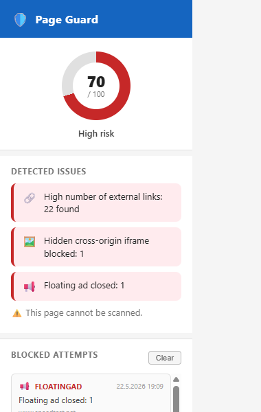
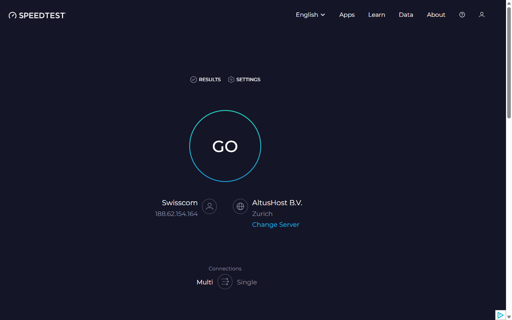

# Page Guard

A Chrome extension that scans webpages for suspicious elements, blocks threats in real time, and shows a risk score.

## Features

| Detector | What it catches | Action |
|---|---|---|
| Popup | Unprompted `window.open()` calls | Blocked; user-initiated calls (within 1 s of a click/keypress) are allowed through |
| Notification | `Notification.requestPermission()` | Intercepted |
| Drive-by download | Programmatic anchor clicks, suspicious blobs | Blocked at the API level |
| Auto-redirect | `<meta http-equiv="refresh">` with delay < 5 s | Neutralized |
| Hidden iframe | Invisible cross-origin iframes | Replaced with `about:blank` |
| Fake play button | External links disguised as video players | Click handler removed |
| Floating ad | Fixed-position ad overlays | Close button clicked, force-hidden if still visible |
| External links | Pages with > 15 outbound links | Flagged |
| Fake download button | Deceptive "Free Download / Install Now" buttons | Flagged |

Each threat type contributes points to a **0–100 risk score** shown as a badge on the page and in the toolbar icon.

## Installation

1. Clone or download this repository.
2. Open `chrome://extensions/` and enable **Developer mode**.
3. Click **Load unpacked** and select the repository folder.

## Risk levels

| Score | Level | Color |
|---|---|---|
| 0 | Safe | — |
| 1–29 | Low | Green |
| 30–59 | Medium | Orange |
| 60–100 | High | Red |

## Testing

Open `test.html` in a browser tab with the extension active to manually trigger individual detectors and watch the risk score update in real time.

## Architecture

Three execution contexts communicate via messages:

- **`main-world.js`** — runs in the page's own JS context; patches browser APIs (`window.open`, `Notification`, `HTMLAnchorElement.prototype.click`, `URL.createObjectURL`) before any page script can call them, then signals `content.js` via `postMessage`.
- **`content.js`** — isolated content script; handles all DOM-based detectors, manages the floating badge, and forwards risk state to the background.
- **`background.js`** — service worker; persists per-tab scores and a capped attempt log (100 entries) in `chrome.storage.local`, and updates the toolbar badge.
